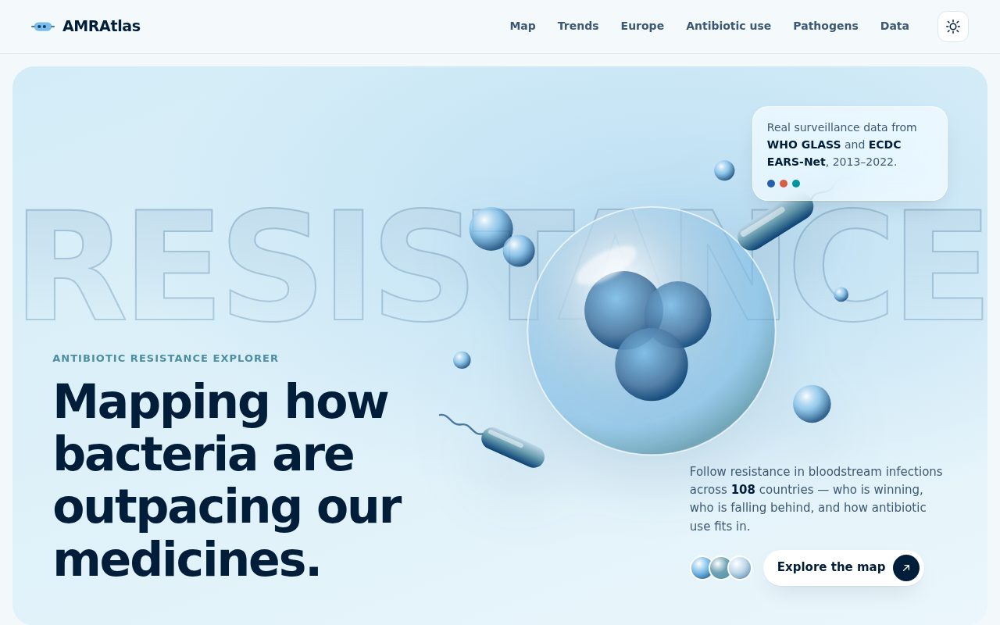
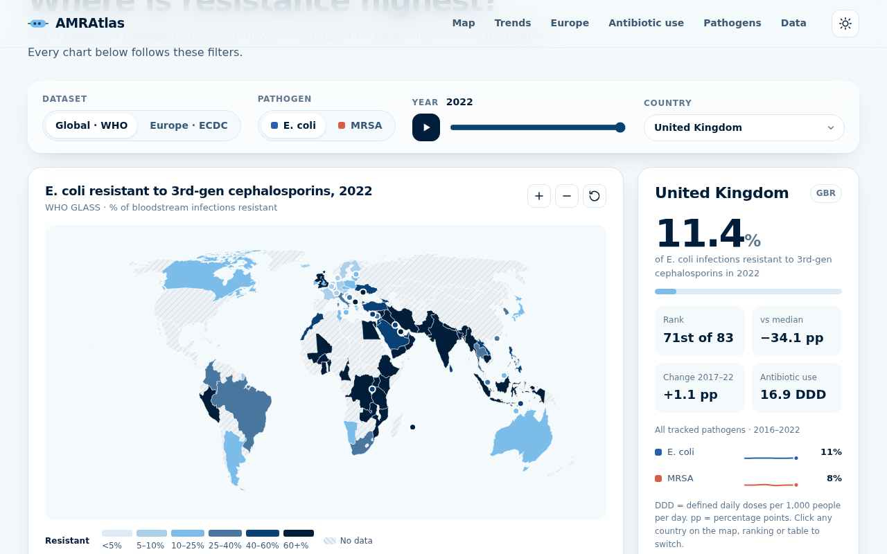

# AMR Atlas — Antibiotic Resistance Explorer

An interactive, responsive website for exploring **real antimicrobial resistance (AMR) surveillance data** from the **WHO Global Antimicrobial Resistance and Use Surveillance System (GLASS)** and the **ECDC European Antimicrobial Resistance Surveillance Network (EARS-Net)**.




## Features

- **Interactive world map.** A zoomable, pannable choropleth. Switch between the global (WHO) and European (ECDC) datasets, the pathogen and the year. Small states get markers, and a ▶ button animates the map through the years.
- **Country profile.** Click any country to see its resistance rate, its rank, how far it sits from the median, its change over time, its antibiotic use, and sparklines for every pathogen.
- **Ranking chart.** The 15 highest or lowest countries, with the median marked.
- **Trend chart.** The selected country against the interquartile band and median of all reporting countries, with a crosshair tooltip.
- **Europe heatmap.** A decade (2013–2022) of ECDC data, one cell per country per year.
- **Antibiotic use vs resistance.** A scatter plot with nearest-point hover and a least-squares line. Pearson *r* and a plain-English reading are computed live.
- **Headline stats.** Computed from the data, including a like-for-like median change that only counts countries reporting in both years.
- **Data table.** Sortable and searchable, with a CSV download of the full dataset.
- **Shareable views.** Every filter is kept in the URL hash, e.g. `#source=ecdc&pathogen=kpn&year=2022&country=GRC`.
- **Light and dark themes.** Both are built from the brand palette `#001D39 #0A4174 #49769F #4E8EA2 #6EA2B3 #7BBDE8 #BDD8E9`.
- **Accessibility.** The chart series colours are checked for colour-blind separation, and no-data areas are hatched instead of shown in grey. Controls work from the keyboard, tooltips appear on focus, and the layout respects `prefers-reduced-motion`.

## Data

| Dataset | Coverage | Measure |
|---|---|---|
| WHO GLASS (via [Our World in Data](https://ourworldindata.org/antibiotics)) | 101 countries, 2016–2022 | % of bloodstream infections due to *E. coli* resistant to 3rd-gen cephalosporins, and due to MRSA (SDG 3.d.2); antibiotic consumption from GLASS-AMC (DDD per 1,000 people per day) |
| ECDC EARS-Net + ESAC-Net ([Surveillance Atlas](https://atlas.ecdc.europa.eu/public/index.aspx)) | 27 EU/EEA countries, 2013–2022 | % of invasive isolates resistant: *E. coli* and *K. pneumoniae* vs 3rd-gen cephalosporins, *S. aureus* vs meticillin; total, community and hospital consumption |

The raw files are in `data/raw/`:

- `who_glass_owid_2016_2022.csv` was extracted with `scripts/extract_glass.py` from the Power Pivot model of the [Antibiotic Resistance Gap Analysis](https://github.com/chamodSN/Antibiotic-Resistance-Gap-Analysis) workbook.
- `ecdc_earsnet_esacnet_2013_2022.csv` comes from [antibiotic-use-and-resistance-ecdc](https://github.com/asiyaghk-bot/antibiotic-use-and-resistance-ecdc). It is a merge of ECDC resistance and consumption data, so a year appears only when both were reported.

Map shapes come from [world-atlas](https://github.com/topojson/world-atlas) (Natural Earth 1:50m) and are simplified at build time.

## Run it

It is a static site with no framework. D3 and topojson-client are vendored in `vendor/`.

```bash
cd amr-explorer
python3 -m http.server 8080   # then open http://localhost:8080
```

To rebuild `data/amr.json` and `data/world.topo.json` from the raw CSVs:

```bash
npm install
npm run build:data
```

## Structure

```
index.html            page markup
css/styles.css        design tokens (light/dark), layout, components
js/main.js            state, URL sharing, stats, profile, table, wiring
js/map.js             D3 choropleth with zoom and small-state markers
js/charts.js          ranking, trend, heatmap, scatter, sparkline
js/config.js          dataset and pathogen metadata, colour classes
js/utils.js           formatting, statistics, tooltip, helpers
scripts/              data extraction and build scripts
data/                 built JSON and raw CSVs
```

## Caveats

Countries report from different numbers of laboratories, and coverage grows over time. Rates from small samples are noisy. The correlation between antibiotic use and resistance does not establish causation. A blank country on the map means no data was reported, not zero resistance.
